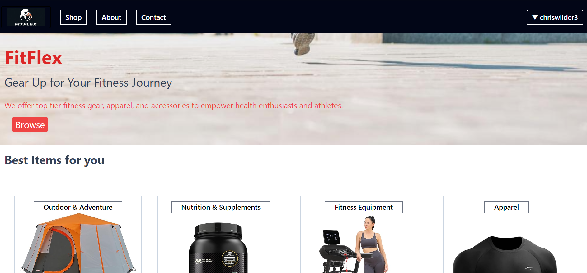
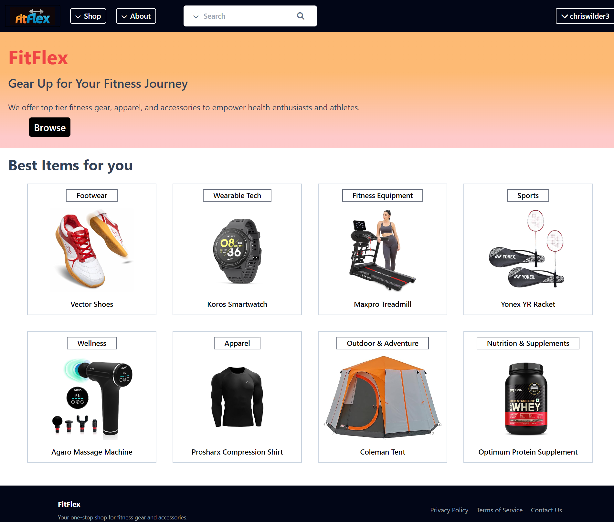
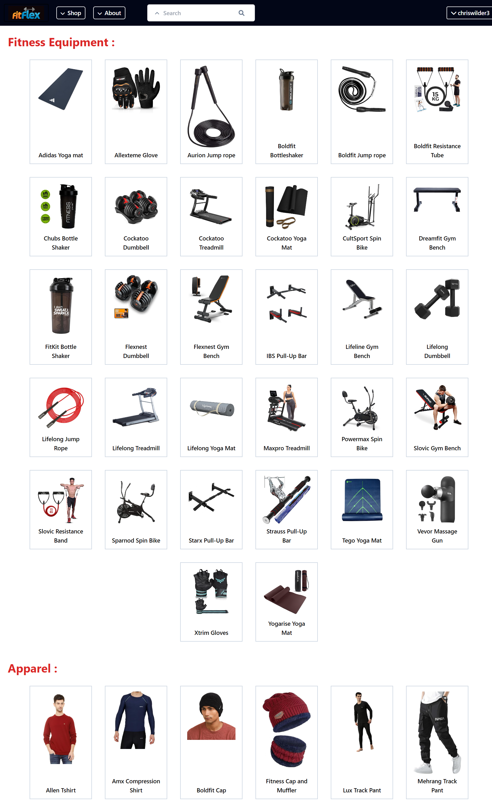
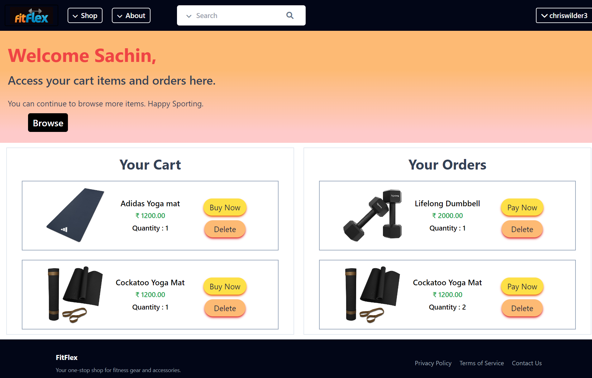

# FitFlex: Gear Up for Your Fitness Journey 🏋️‍♂️🛒

FitFlex is an online e-commerce platform dedicated to providing high-quality fitness gear, apparel, and accessories for health enthusiasts and athletes alike. Whether you're hitting the gym, going for a run, or exploring yoga, FitFlex empowers your fitness journey with the right tools and style.

---
## Prev and Current Progress Screenshots:
  
    ↓
  
  
  

## 🌟 **Features**
- **Dynamic Product Catalog**  
  Browse through a wide variety of fitness products, including:
  - Apparel (T-shirts, hoodies)
  - Accessories (water bottles, resistance bands, mats)
  - Gear (weights, gloves, shoes)

- **User Authentication**  
  - Secure user registration and login system.
  - Persistent sessions with Django's authentication framework.

- **Interactive Shopping Cart**  
  - Add, remove, or update items in your cart in real time using JavaScript.
  - Responsive UI for easy navigation on mobile and desktop.

- **Smooth Checkout Process**  
  - Seamless integration with payment gateways.
  - Order summary and confirmation page.

- **Admin Dashboard**  
  - Manage product listings, inventory, and orders efficiently.
  - Analytics to track user activity and sales.

- **Search and Filtering**  
  - Find products quickly with advanced search functionality.
  - Filter by category, price range, and popularity.

---

## 🛠️ **Tech Stack**
- **Frontend**  
  - HTML5, CSS3, JavaScript, Bootstrap/Tailwind CSS for responsive design.
  - Dynamic interactions powered by JavaScript.

- **Backend**  
  - Django framework (Python) for robust server-side operations.
  - PostgreSQL/MySQL database for managing data.

- **APIs and Integrations**  
  - RESTful APIs for seamless frontend-backend communication.
  - Payment gateway APIs for transactions.

